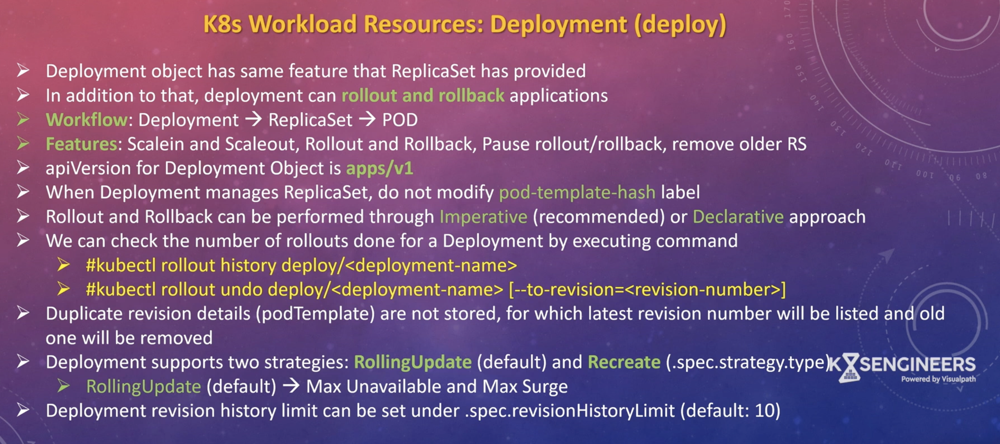

![[k8s/workload_resources/pics/Pasted image 20260327050954.png]]

![[k8s/workload_resources/pics/Pasted image 20260327045958.png]]


#### What is Replication?
> Replication in Kubernetes means running multiple identical copies of a pod to ensure high availability and scalability. We define the desired number of replicas, and Kubernetes automatically maintains that count using controllers like Deployments and ReplicaSets.
>
>It provides several benefits:
>- **Reliability**: Ensures a minimum number of pods are always running, and replaces failed pods automatically.
>- **Load Balancing**: Traffic is distributed across multiple pod replicas using a Service.
>- **Scaling**: We can increase or decrease the number of replicas based on demand, either manually or using autoscaling.
>
![[k8s/workload_resources/pics/Pasted image 20260327051306.png]]

---

#### Replication Controller
> A Replication Controller is a controller that ensures a specified number of pod replicas are always running at any given time. It continuously monitors the pods and, if any pod fails or is deleted, it automatically creates a new one to maintain the desired state. It also supports scaling by increasing or decreasing the number of replicas.
> 
It uses label selectors to manage pods and follows a pod template to create identical replicas.
>
Replication Controller is a legacy resource and is mostly replaced by ReplicaSets and Deployments, which provide more advanced features.
>
![[k8s/workload_resources/pics/Pasted image 20260327052806.png]]


```bash
kubectl edit node desktop-control-plane
```

```bash
kubectl api-resources
kubectl api-resources | grep replica
```

```
kubectl get pod -o wide --show-labels
```
```
kubectl scale --replicas=5 rc/nginx-demo-rc
```
```
kubectl scale --replicas=5 rc/nginx-demo-rc
```

```
sudo kubectl port-forward nginx-demo-rc-5f928 80:80
```

```
k delete --cascade=orphan rc nginx-demo-rc
```

## ReplicaSet
> A ReplicaSet in Kubernetes is a workload resource that ensures a specified number of identical pod replicas are running at any given time. It continuously monitors the pods and creates or deletes them to match the desired replica count.
It works using label selectors and a pod template to manage and create identical pods. ReplicaSet also provides self-healing by automatically replacing failed pods and supports scaling.
> ReplicaSets are not used directly; instead, they are managed by Deployments, which provide additional features like rolling updates and rollbacks.
>


```
kubectl label po nginx-demo-rs-24dhj app-
pod/nginx-demo-rs-24dhj unlabeled
```


![[k8s/workload_resources/pics/image-1.png]]


## Deployment


```
kubectl get deploy,rs,po -o wide
```


```
kubectl scale --replicas=5 deploy/nginx-deploy
```

```
kubectl describe deploy/nginx-deploy

Annotations:            deployment.kubernetes.io/revision: 1

StrategyType:           RollingUpdate
MinReadySeconds:        0
RollingUpdateStrategy:  25% max unavailable, 25% max surge
```

#### strategy type: Rolling Update (RollingUpdateStrategy:- Max surge, Max available)

```
kubectl rollout history deploy/nginx-deploy
deployment.apps/nginx-deploy 
REVISION  CHANGE-CAUSE
1         <none>

kubectl rollout history deploy/nginx-deploy --revision=1
deployment.apps/nginx-deploy with revision #1
Pod Template:
  Labels:	app=nginx
	environment=production
	pod-template-hash=6b976d7cd9
	release=v1.0
  Containers:
```

```
kubectl set image deploy nginx-deploy service-container=nginx:latest
```

```

kubectl set image deploy nginx-deploy service-container=nginx:1.28.2

```

```

kubectl rollout undo deploy nginx-deploy --to-revision=1

REVISION  CHANGE-CAUSE
2         <none>
3         <none>
4         <none>
```

---
DemaonSet
